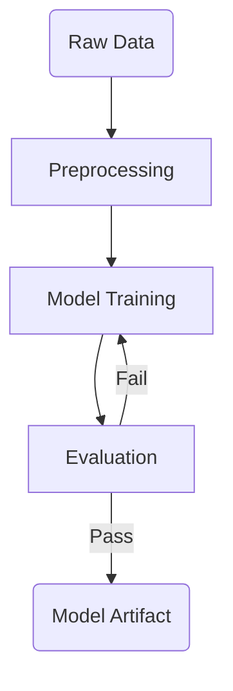
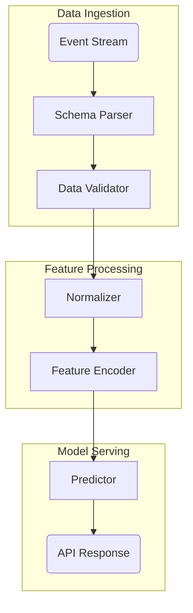
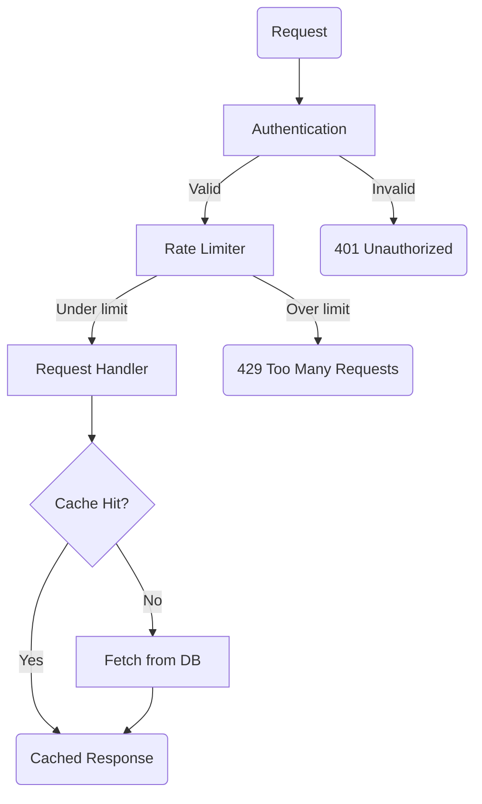
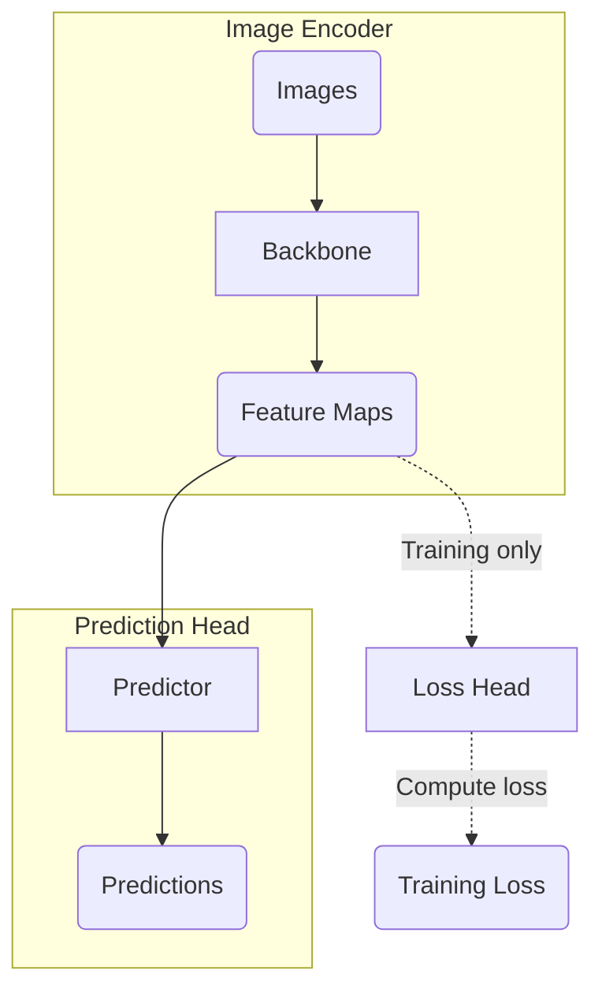

# Mermaid Diagram Guide

Reference for generating mermaid diagrams inside lark-hirono documents.

## What the Pipeline Does Automatically

You write clean mermaid — the pipeline handles all visual styling:

| What pipeline adds | How |
|---|---|
| `%%{init: {"theme":"base"} }%%` | `applyMermaidTheme` |
| Subgraph fill `#f7f9ff` / stroke `#d6def2` | Style lines appended |
| Endpoint node fill `#fff4df` / stroke `#f4ead0` | Style lines appended |
| Edge label background `#f4deff` | Whiteboard DSL patch post-upload |

**You never need to write `style`, `%%{init}%%`, or `classDef` manually.** The pipeline detects:
- Top-level `subgraph` blocks → blue-grey container fill
- Source/sink nodes (in/out-degree = 0) with keywords like `input`, `output`, `start`, `end`, `source`, `sink`, `ingress`, `egress` → cream endpoint fill
- Edge labels `-->|text|` → light purple background on upload

---

## When to Generate a Mermaid Diagram

**Generate** when the document describes any of these:
- Multi-stage pipeline or workflow (ML training, data pipeline, CI/CD, request lifecycle)
- System architecture with components and data flow
- Algorithm with branching decisions
- Process with clear start → steps → end
- Component relationships with labeled interactions

**Skip** when the document is:
- A reference list or lookup table (no flow structure)
- A pure data table (catalog, schedule, metrics dump)
- A single concept definition (no relationships to draw)
- An FAQ or Q&A format
- Already has a diagram that covers the same ground

**Rule of thumb**: if you can draw an arrow between two things and label it meaningfully, a diagram adds value.

---

## Placement

Always place the diagram **immediately after the top callout**, before the first heading:

```markdown
<callout emoji="🚀" background-color="light-blue" border-color="light-blue">
Document description here.
</callout>


## 1 First Section
```

---

## Diagram Patterns

### Pattern 1 — Linear Pipeline (most common)

Use for: ML training pipelines, data processing, ETL, request handling.



**Notes:**
- `Input(...)` and `Export(...)` use rounded shape → detected as endpoints → cream fill
- `-->|label|` edge labels → purple background in Feishu
- Cycle back edge (`Fail → Train`) is fine

---

### Pattern 2 — Multi-Stage Architecture with Subgraphs

Use for: system architecture, multi-component pipelines, ML model stages.



**Notes:**
- Each `subgraph` label becomes bold with blue-grey fill
- `Source(...)` and `Output(...)` are endpoints → cream fill
- Keep subgraph names as valid identifiers (no spaces): `Ingestion`, `Processing`

---

### Pattern 3 — Decision Flow

Use for: algorithms with branching, approval workflows, condition-based routing.



**Notes:**
- `{Cache Hit?}` uses diamond shape for decision nodes
- Terminal nodes (`Reject`, `Throttle`, `Return`) are sinks → endpoint fill
- `Start(Request)` is a source → endpoint fill

---

### Pattern 4 — Dotted Training-Only Branches

Use for: ML architectures where some paths are training-only (not inference).



**Notes:**
- `-.->`  renders as dotted arrow → use for training-only / optional paths
- `Loss(...)` has zero out-degree and "Loss" doesn't match endpoint keywords → won't auto-style
  - If you want endpoint style, rename: `Loss(Training Loss Output)` — "output" triggers it
- Edge labels on dotted arrows also get purple background

---

## Conciseness Rules

Feishu whiteboards have limited space. Keep diagrams readable:

| Limit | Target |
|---|---|
| Nodes per diagram | ≤ 15 |
| Subgraphs | ≤ 4 |
| Edge label length | ≤ 4 words |
| Node label length | ≤ 5 words |

If the document describes a very large system, diagram the **top-level flow only** — skip implementation details.

---

## Common Mistakes

**Don't put spaces in subgraph IDs:**
```markdown
# ❌ breaks mermaid parsing
subgraph Stage 1 [Stage 1: Encoder]

# ✅ identifier + display label
subgraph Stage_1 [Stage 1: Encoder]
```

**Don't use special characters in node IDs:**
```markdown
# ❌
API-Gateway[API Gateway]   # hyphens break node IDs

# ✅
ApiGateway[API Gateway]
```

**Don't duplicate node IDs across subgraphs:**
```markdown
# ❌ both subgraphs have a node called "Input"
subgraph A
    Input --> Process
end
subgraph B
    Input --> Store   # same ID → mermaid merges them
end

# ✅ unique IDs
subgraph A
    InputA(Input) --> Process
end
subgraph B
    InputB(Input) --> Store
end
```

**Don't add style blocks — the pipeline handles them:**
```markdown
# ❌ pipeline will overwrite or conflict
style Start fill:#ff0000

# ✅ just write the structure
graph TD
    Start(Entry) --> Process[Main Logic]
```
